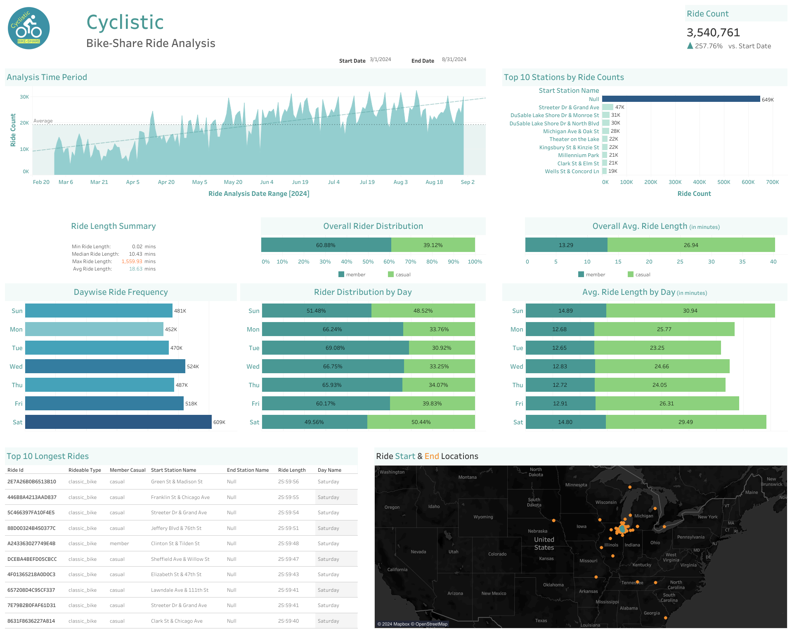

Here's the updated version of your `README.md` to reflect the dual licensing for your code and the Divvy data:

---

# Cyclistic Bike-Share Analysis

## Project Overview
This project analyzes Cyclistic's bike-share data to understand usage patterns between annual members and casual riders, aiming to design marketing strategies for converting casual riders into annual members.

## Key Findings

- **Membership Split:** 60.88% annual members, 39.12% casual riders
- **Ride Duration:** Casual riders average 26.94 mins/trip vs 13.29 mins for members
- **Weekly Patterns:** Members dominate weekdays, casual riders increase on weekends
- **Popular Station:** "Streeter Dr & Grand Ave" is the busiest

## Tools Used
- SQL Server
- Tableau
- PowerPoint

## Repository Structure
- `/sql`: SQL queries for data cleaning and analysis
- `/tableau`: Tableau dashboard files and screenshots
- `/presentation`: Final presentation slides
- `/documentation`: Detailed project and data cleaning documentation
- `/logo`: Project and company logos

## Quick Links
- [Full Project Documentation](documentation/project_documentation.md)
- [SQL Analysis](sql/cyclistic_ride_analysis.sql)
- [Presentation](presentation/cyclistic_presentation.pdf)

## Data Source
Data is sourced from Cyclistic's historical trip data, available [here](https://divvy-tripdata.s3.amazonaws.com/index.html). The analysis uses data from March 2024 to August 2024.

## License

This project is licensed under the **MIT License** for the code and analysis provided. However, the **data** used in this project is provided by Divvy and is subject to the **Divvy Data License Agreement**. Please review the relevant license files below for more information:

- The **MIT License** applies to the code and documentation in this repository. See the [LICENSE](LICENSE) file for details.
- The **Divvy Data License Agreement** applies to the data used in this project. See the [Divvy Data License Agreement](documentation/divvy_data_license.md) for more information.

## Contact
For any queries regarding this project, please open an issue in this repository.

